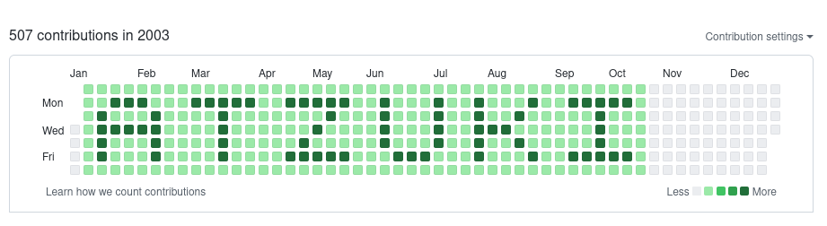
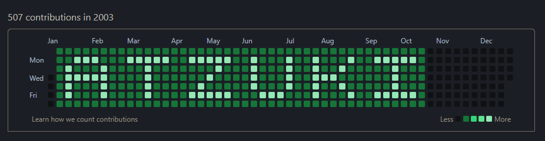

# Kohut 

## What is Kohut?
Kohut is a simple CLI tool written in NodeJS for creating next level github contribution graphs. 

## Why Kohut?
Kohut is the first tool that let's you write text to your contributions graph. It's free and easy to use.

Just look how cute logo you can write on your github *mainpage*.

  

  

## How can I use it?